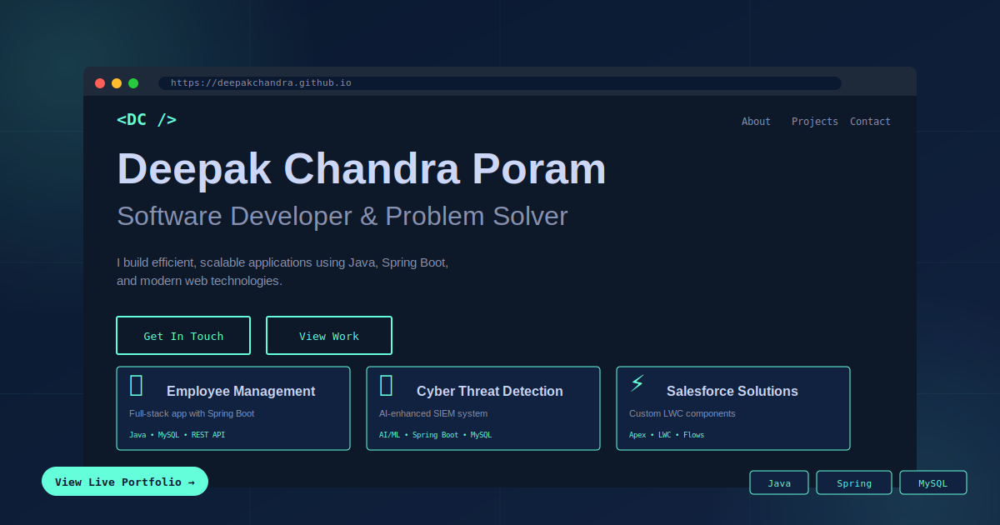

# 💼 Professional Portfolio



<div align="center">

### 🚀 [View Live Portfolio](https://deepakchandra.github.io) 🚀

[](https://deepakchandra.github.io)
[](https://developer.mozilla.org/en-US/docs/Web/HTML)
[](https://developer.mozilla.org/en-US/docs/Web/CSS)
[](https://developer.mozilla.org/en-US/docs/Web/JavaScript)

</div>

---

## 👨‍💻 About

This is my professional portfolio website showcasing my journey as a **Software Developer**. Built with modern web technologies and designed with a focus on user experience and performance.

### ✨ Features

- 🎨 **Modern Design** - Clean, professional dark theme with smooth animations
- 📱 **Fully Responsive** - Perfect on desktop, tablet, and mobile devices
- ⚡ **Fast Loading** - Optimized for performance
- 🎯 **Interactive UI** - Smooth scroll, hover effects, and transitions
- 💼 **Project Showcase** - Detailed view of my development projects
- 📧 **Easy Contact** - Multiple ways to get in touch

---

## 🛠️ Built With

- **HTML5** - Semantic markup
- **CSS3** - Modern styling with animations
- **JavaScript** - Interactive functionality
- **Google Fonts** - Custom typography (Crimson Pro & JetBrains Mono)

---

## 📂 Sections

### 🏠 Home
Eye-catching hero section with introduction and call-to-action buttons

### 👤 About Me
Background, education, and technical expertise

### 💼 Experience
- **Salesforce Intern** @ Antra Inc
- **Web Developer** @ Hippo Cloud Pvt Ltd

### 🚀 Projects

#### 📊 Employee Management System
Full-stack application with role-based access control
- **Tech Stack:** Java, Spring Boot, MySQL, HTML/CSS
- **Features:** CRUD operations, RESTful APIs, optimized database design

#### 🛡️ Neural Event Profiles for Cyber Threat Detection
AI-enhanced SIEM system for real-time threat detection
- **Tech Stack:** Java, Spring Boot, AI/ML, MySQL
- **Features:** Deep learning models, real-time monitoring, threat intelligence

### 🎯 Skills
Organized by categories:
- Programming Languages (Java, Python, JavaScript, SQL)
- Frameworks (Spring Boot, Hibernate, Bootstrap)
- Databases (MySQL, SOQL)
- Tools (Git, Postman, Eclipse, VS Code)
- Best Practices (RESTful APIs, MVC, Version Control)

### 📬 Contact
Multiple contact options with direct links

---

## 🚀 Quick Start

### Clone the Repository
```bash
git clone https://github.com/deepakchandra/portfolio.git
cd portfolio
```

### View Locally
Simply open `index.html` in your browser:
```bash
# On Windows
start index.html

# On Mac
open index.html

# On Linux
xdg-open index.html
```

### Deploy to GitHub Pages
1. Fork this repository
2. Go to Settings → Pages
3. Select `main` branch as source
4. Your portfolio will be live at `https://yourusername.github.io/portfolio/`

---

## 📊 Project Structure

```
portfolio/
│
├── index.html              # Main HTML file
├── portfolio-preview.svg   # Preview image for README
└── README.md              # This file
```

---

## 🎨 Customization

### Change Colors
Edit the CSS variables in `index.html`:
```css
:root {
    --primary: #0a192f;      /* Dark blue background */
    --accent: #64ffda;       /* Cyan accent color */
    --text: #8892b0;         /* Light gray text */
    --text-bright: #ccd6f6;  /* Bright text */
}
```

### Add Projects
Duplicate a project card in the HTML and modify the content:
```html
<div class="project-card">
    <h3 class="project-title">Your Project Name</h3>
    <p class="project-description">Description here...</p>
    <div class="project-tech">
        <span class="tech-tag">Tech 1</span>
        <span class="tech-tag">Tech 2</span>
    </div>
</div>
```

### Update Contact Info
Modify the contact section with your details:
```html
<a href="mailto:your.email@example.com">Email</a>
<a href="tel:+919876543210">Phone</a>
<a href="https://linkedin.com/in/yourprofile">LinkedIn</a>
<a href="https://github.com/yourusername">GitHub</a>
```

---

## 📈 Performance

- ✅ Lightweight (< 100KB total)
- ✅ No external dependencies (except Google Fonts)
- ✅ Fast load time (< 1 second)
- ✅ SEO optimized
- ✅ Mobile-first responsive design

---

## 🔧 Future Enhancements

- [ ] Add dark/light mode toggle
- [ ] Include blog section
- [ ] Add project screenshots
- [ ] Implement contact form with backend
- [ ] Add animations with GSAP
- [ ] Include testimonials section
- [ ] Add resume download button

---

## 📱 Connect With Me

<div align="center">

[](https://linkedin.com/in/deepakchandra)
[](https://github.com/deepakchandra)
[](mailto:deepakchandraporam@gmail.com)
[](https://deepakchandra.github.io)

</div>

---

## 📄 License

This project is open source and available under the [MIT License](LICENSE).

---

## 🙏 Acknowledgments

- Design inspiration from modern developer portfolios
- Icons and fonts from Google Fonts
- Hosted on GitHub Pages

---

<div align="center">

### ⭐ If you like this portfolio, please give it a star!

**Made with ❤️ by Deepak Chandra Poram**

© 2025 Deepak Chandra Poram. All Rights Reserved.

</div>
